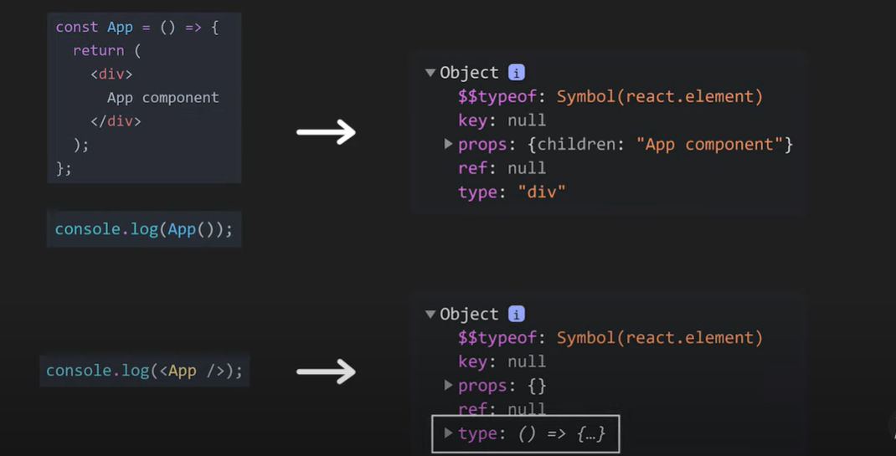

<h2> 
Reconciliation is an algorithm which uses the concept of virtual DOM to differentiate between the two trees to know which part has changed and only render the changed part rather than updating the whole DOM
</h2> 

<h1>React Element<h1>

Functional Component return JSX. JSX is then converted into react element function. Which is a virtual DOM

<ul>
<li>$$type of key the react element is for security purpose</li>
</ul>

<h1>React Component<h1>

React Component can be of two type functional based and class based. If it is functional based component the output is the returned value of the function. If it is class based component then output is the returned value of the render method.

<ul>
<li>
</li>
</ul>

<h1>The Diff Algorithm<h1>
<ul>
<li>React can't just re-render the whole tree</li>
<li>React compares the tree and finds the smallest number of operation to transform one tree into other</li>
<li>This is handled by Diff Algorithm</li>
<li><b>Tree Diffing</b></li>
<li>Tree Diffing takes time complexity of O(N^3)</li>
<li>Comparing each node in tree with T1 and T2 takes O(N^2) operation</li>
<li>Also, for each pair of node, the algorithm may need to compare their respective subtrees, leading to additional nested comparision. Which leads to time complexity of O(N^3) </li>
 
 
 
<b>React “heuristic” algorithm</b>
<li>Heuristic algorithm refers to the reconciliation process that react uses to efficiently update the user interface when state of the component changes</li>
<li>This algorithm is designed to minimize the steps to update the DOM</li>
<li>
</li>
<li>
</li>
<li>
</li>
</ul>
